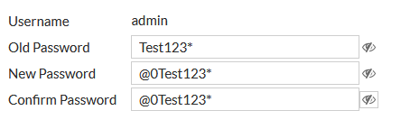

# School-cyber

0 heures de sommeil pour nous


## Topologie Réseau

```
Adresse réseau: 172.30.0.0
Masque: 255.255.0.0
``` 

## Config de minicom


```
sudo dnf install minicom
```

Pour lancer :
```
sudo minicom -D /dev/ttyUSB0 -b 9600
```

## Config de screen

```
sudo dnf install screen
```

Pour lancer :

```
sudo screen /dev/ttyUSB0 9600
```

## Fortigate Configuration 

```
Modèle: FortiGate 60E
Firmware: v7.4.3 build2573
Hostname: AG_7_FW_1_PD_P
Serial number: FGT60ETK1809A3ED
```

Idenfitifiants de connexion: 
```
Login: admin
PWD: @0Test123*
```



Accès à la GUI depuis le port Ethernet 1
```
https://192.168.1.99
```

## Cisco Router Configuration

```
Modèle
Firmware:
Hostname: AG_7_RT_1_PD_P
Serial number: 
```

Identifiants
```
Enable secret: @0Test123*
Enable password: @0Test123*
Virtual Terminal Password: @0Test123*

Login: admin
Pwd: @0Test123*

```

Management Network Interface:

```
GigabitEthernet0/0/0 => WAN1 (192.168.0.138/30 255.255.255.252)
GigabitEthernet0/0/1 => FW (172.30.200.1/30 255.255.255.252) .1 pour l'interface
GigabitEthernet0/0/2
GigabitEthernet0/0/3
```

## Cisco Switch Configuration

```
Modèle:
Firmware:
Hostname: AG_7_S2_PD_P
Serial number: 
```

Identifiants

```
Enable secret: @0Test123*
Enable password: @0Test123*

Login: admin
Pwd: @0Test123*

```

Management Network Interface:

```
GigabitEthernet1/0/20
```


A rajouter 

IPSG
Verifier la limite de dhcp snooping 100 au lieu de 10 dans la doc cisco ??

STP

Port security

VTP

